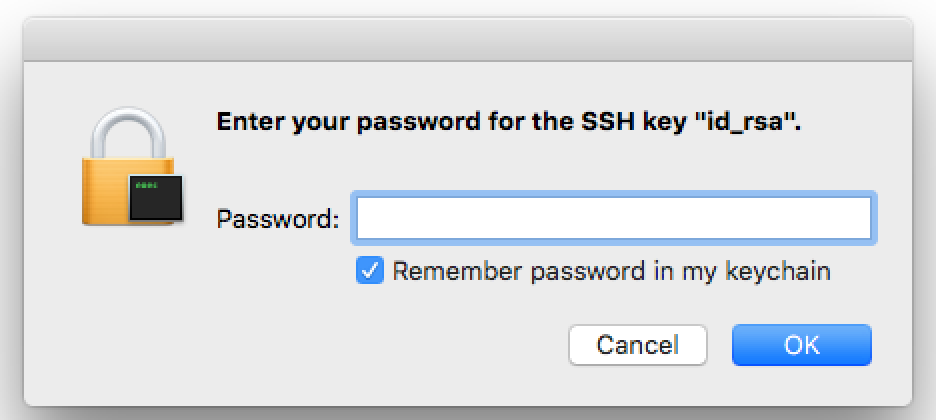

# Mac Setup for Rails Development: Doing it Right

This is an opinionated guide to setting up a Rails development environment on a Mac. If you have the choice, always choose a Mac for your development environment. It's just easier. Linux works too, but the instructions will be completely different from what's described here.

This guide is written assuming you have OS X El Capitan 10.11 or later as your operating system. (The guide may still work for OS X 10.9 or 10.10, but is not guaranteed. You should upgrade to 10.11 before proceeding.)

We've written this guide to help new-ish developers setup a clean system. If you already have some of this software installed, you'll have to adjust accordingly. If you use RVM or MacPorts, you'll need to fully uninstall those before continuing as they're incompatible with rbenv and HomeBrew, which are our preferred tools.

This guide assumes that you're using bash shell, which is the default shell for the OS X Terminal.app. We also assume that you use `.bash_profile` to setup `PATH` and other environment variables. If you use a different bash config file, be sure to substitute it where appropriate below.

## XCode and Command Line Tools

We need to install the tools that allow us to compile programs specifically for your machine. These are provided by Apple and are pretty easy to install.

### If you're running Mac OS X 10.8 or earlier

Please upgrade to the latest version of OS X before continuing (Currently El Capitan 10.11).

### If you are running Mac OS X 10.9 or later

You can save yourself a lot of time downloading and installing XCode by running the following command on the command line and accepting all of the prompts to install:

```bash
xcode-select --install
```

## HomeBrew

[HomeBrew](http://brew.sh/) is a package manager for OS X, which we'll use to install most of our command-line applications. It's a much more convenient alternative to compiling the code ourselves from source (or using MacPorts).

To install HomeBrew, copy, paste and run the following at the command line:

```bash
ruby -e "$(curl -fsSL https://raw.githubusercontent.com/Homebrew/install/master/install)"
```

Then close terminal and re-open it (restart Terminal).

Now run

```bash
brew doctor
```

to make sure HomeBrew installed correctly.

### Your system is ready to brew

If brew doctor says `Your system is ready to brew`, then everything worked properly and you can skip the following step *"Your system is not ready to brew"*. Lucky you.

### Your system is not ready to brew

You might see something like this:


This is a problem. Let's fix this by moving the bin directory that HomeBrew sets up for us ahead of every other folder specified in PATH. Run the following:

```bash
echo export PATH='/usr/local/bin:$PATH' >> ~/.bash_profile
```

This will create a `.bash_profile` config file which is read and executed each time a new terminal is opened. To apply changes made to this file, you can either restart terminal (ghetto mode), or run `source ~/.bash_profile`.

If you see other issues, try reading the instructions carefully and doing what they suggest. If `brew doctor` continues to issue warnings, you can contact [Mina](mailto:mina@bitmakerlabs.com), [Ilia](mailto:ilia@bitmakerlabs.com), or [Fred](mailto:fred@bitmakerlabs.com) for help.

Test this out by installing wget via HomeBrew: 

```bash
brew install wget
```

Now run :

```bash
brew update
```

to get the latest HomeBrew formulas.

### An Aside: Why PATH Order is Important

Command-line executables are searched by going through each folder in the PATH variable, one by one in the order listed. As soon as an app with the same name is found, it stops searching the rest of the folders. OS X comes with built-in apps (and you might have your own apps installed prior to this), but we often want to use newer versions instead. To make sure the newer version gets 'picked up', we need to ensure that the symlinked HomeBrew /bin folder comes before other system folders. To see the PATH directories, run

```bash
echo $PATH
```

HomeBrew packages are downloaded and installed in `/usr/local/Cellar/` by default, and symlinked into `/usr/local/bin`. This folder will not be overriden the next time Apple releases an incremental feline update.

### Food for Thought

* How do I get a list of homebrew packages that are installable?
* How do I get a list of currently installed homebrew packages?
* How do I update an existing package?


## Sublime Text

### Install Sublime

Download and install [Sublime Text](http://www.sublimetext.com/3). This is the text editor of choice for discerning, good-looking individuals.

Make sure to drag the app into to the Applications folder before running it.

Run the program to make sure that it works.

### Sublime Command-Line tools

Sublime Text comes with a command-line app called `subl`. We're going to install this in the Homebrew `bin` directory instead of `~/bin` as stated on the Sublime Text website.

```bash
ln -s "/Applications/Sublime Text.app/Contents/SharedSupport/bin/subl" /usr/local/bin/subl
```

Now we can open up files (and folders!) from the command line using

```bash
subl name_of_file_or_folder
```

Now that you've got this set up, you might also want to set Sublime Text as your default system editor. Much easier to use than `vim`!

```bash
echo 'export EDITOR="subl -w"' >> ~/.bash_profile
```

For more information: [Sublime Text Command Line Tools Documentation](https://www.sublimetext.com/docs/3/osx_command_line.html)

## rbenv

```bash
brew install rbenv
```

This installs [rbenv](https://github.com/sstephenson/rbenv), a lightweight tool to manage different versions of Ruby. OS X comes with an old version of Ruby, but we'll generally want to have our own, newer versions of it.

Install rbenv will automatically install [ruby-build](https://github.com/sstephenson/ruby-build), a plugin for rbenv to conveniently install different versions of Ruby.

Now we need to modify our bash config, paste the following in your terminal.

```bash
echo 'eval "$(rbenv init -)"' >> ~/.bash_profile
```

Then close terminal and re-open it (restart Terminal) to apply the changes.

If you look at your path:

```bash
echo $PATH
```

you should see that reloading your config has inserted `/Users/(you)/.rbenv/shims` to the beginning of your `$PATH` variable. This is necessary for rbenv to work its magic.

## Ruby

To install ruby 2.3.0 (substitute this for the latest recommended version of Ruby indicated on the [Rails website](http://rubyonrails.org/download)):

```bash
rbenv install 2.3.0
```

This may take some time. Go get a coffee. 

After this finishes, you can setup your global (default) Ruby:

```bash
rbenv global 2.3.0
```

Make sure the right version is running:

```bash
ruby --version
```

It should say `ruby 2.3.0p0 (2015-12-25 revision 53290) [x86_64-darwin15]` or something similar.

Note that you can override this global setting per project. See [Choosing the Ruby Version](https://github.com/sstephenson/rbenv#choosing-the-ruby-version) for more information.

You can install other rubies (different versions of ruby) this way as well.

## RubyGems

RubyGems is a package management framework for Ruby. It ships with Ruby 2.0.0+. We use it to install Ruby apps such as Rails. If you need to install this manually, see [http://rubygems.org/pages/download](http://rubygems.org/pages/download).

Run the following to update to the latest version.

```bash
gem update --system
```

Next up run to install [Bundler](http://bundler.io/)

```bash
gem install bundler
```

## Postgres

PostgreSQL is awesome. Prefer it over MySQL if you have the choice.

The easiest way to install this is via [Postgres.app](http://postgresapp.com/). Download it, drag it to the applications folder, and then double-click to launch. While it's open, the database server is running (it adds an elephant icon to your taskbar). When you close it, the database server shuts down.

### Postgres Command-Line Tools

Install the Postgres command-line tools as follows:

```bash
echo 'export PATH=$PATH:/Applications/Postgres.app/Contents/Versions/9.4/bin' >> ~/.bash_profile
```

For more information: [Postgres Documentation](http://postgresapp.com/documentation/)

## Rails

You need to have Rails installed in order to create new Rails projects. After the project is created (or if you're working with an existing Rails project), you'll be using the bundled versions of Rails specific to your project.

For this course, we'll be using Rails 4.2.5.

```bash
gem install rails -v 4.2.5
```

**Never run sudo in front of these gem commands**, or it may install to the wrong folder.

You can look at your gems by running

```bash
gem list
```

Verify that Rails is there and that the version is 4.2.5.

```bash
rails --version
```

It should say `Rails 4.2.5`.


### Making a New Rails Project

You should create a directory to put all of your work inside.

```bash
mkdir ~/Documents/work
```

This will create a `work` directory inside the OS X `Documents` folder. The words directory and folder are interchangeable. Folder is generally used by non-technical people and directory is generally used by technical people. Now that you are being initiated as techies, we'll use the directory term!

The `~` refers to your [Home Directory](http://superuser.com/questions/158721/what-does-mean-in-terms-of-os-x-folders-directories). You should put all of your work for this course inside this directory.

Go inside the work directory

```bash
cd ~/Documents/work
```

and then make a new Rails project.

```bash
rails new my_awesome_app
```

This step will probably take a few minutes the first time you create a new Rails project. The next time, it'll run much faster.

Next, go into your new project directory

```bash
cd my_awesome_app
```

then run

```bash
bin/rails server
```

Visit `http://localhost:3000` in your browser. If you see the **Welcome aboard** page, congrats – Rails works!

You can type `ctrl + c` into your terminal to stop the Rails application.

In this course, you're going to be running the `bin/rails server` and `ctrl + c` commands very, very often, so go ahead and memorize them now!

### Delete the new Rails project (optional)

To keep your work directory clean, let's delete the new project you just created.

You are currently in your project directory. Let's go back up one directory, to your work directory.

```bash
cd ..
```

Double check the contents of the directory

```bash
ls
```

If you've followed all the directions so far, there should only be single item called `my_awesome_app`. Go ahead and delete this project, it has served its purpose.

```bash
rm -rf my_awesome_app
```

## Git

### Register on Github

First you'll need to setup your GitHub account. Go to [github.com](http://github.com) and register a free account with your usual email address.

### Set up Git

git comes with OS X but it's typically an older version. Let's get a newer one.

```bash
brew install git
```

Then close terminal and re-open it (restart Terminal).

Then run

```bash
git --version
```

It should say something like `git version 2.6.4`. The version number should be >= 2.6.

Next, tell Git your name so that your commits will be properly labelled. Substitute your actual name for `YOUR NAME`, of course.

```bash
git config --global user.name "YOUR NAME"
```

Now tell Git the email address that will be associated with your Git commits. This email address should be the same one that you registered on Github with. Subtitute it for `YOUR EMAIL ADDRESS` below.

```bash
git config --global user.email "YOUR EMAIL ADDRESS"
```

More information: [Github documentation on setting up Git](https://help.github.com/articles/set-up-git#set-up-git)

### Generate SSH Keys

SSH keys are definitely a better setup to use with Git than HTTPS. This is so you don't have to type your password every time you push. Don't worry if these terms don't mean anything to you right now, you'll eventually learn what they are during your journey as a developer.

First let's make sure you don't already have existing SSH keys on your computer.

```bash
ls -la ~/.ssh
```

It should say something like `No such file or directory`.

With Terminal still open, run the following. Be sure to subtitute your Github email address.

```bash
ssh-keygen -t rsa -b 4096 -C "YOUR EMAIL ADDRESS"
```

When you are prompted to `Enter file in which to save the key`, just press **Enter** to continue and it will use the default filename `id_rsa`.

You'll then be asked to `Enter passphrase (empty for no passphrase)`. Enter a very good, secure passphrase (be sure that it's something you can remember). 

Go ahead and memorize that passphrase now because it'll be needed again soon, in the *Test the Connection* step.

Next you'll be asked to `Enter same passphrase again`. Do so. You sould then see something like:

```
Your identification has been saved in /Users/user/.ssh/id_rsa.
Your public key has been saved in /Users/user/.ssh/id_rsa.pub.
The key fingerprint is:
SHA256:blw174u+1MfrpxaacBOqP4DLHyxUqcMPoOQ3+ijXOic anonymous@gmail.com
The key's randomart image is:
+---[RSA 4096]----+
|                 |
|         .       |
|  . .   o   o    |
| o . o o   ..o   |
|  o o *.S .. ..  |
|   o o.B..o oo.. |
|  .. ...Bo o.+o.o|
|. Eoo oo....o..oo|
| oo=.  ....o+o++.|
+----[SHA256]-----+
```

And it means we can move onto the next step.

For more information: [Github documentation on generating SSH Keys](https://help.github.com/articles/generating-ssh-keys)

### Add your SSH Key to your Github Account

Copy the SSH key to your clipboard.

```bash
pbcopy < ~/.ssh/id_rsa.pub
```

Follow these steps to add the copied key to your Github account. 

* In the top right corner of Github, click your profile photo, then click Settings.
* In the user settings sidebar, click **SSH keys**.
* Click **Add SSH key**.
* In the Title field, add a descriptive label for the new key. For example, if you're using a personal Mac, you might call this key "Personal MacBook Air".
* Paste your key into the "Key" field. (`ctrl-v`)
* Click **Add key**.

For more information: [Github documentation on adding your SSH Key to your account](https://help.github.com/articles/generating-ssh-keys/#step-4-add-your-ssh-key-to-your-account)

### Test the Connection

Open Terminal and enter:

```bash
ssh -T git@github.com
```

You will see something like:

```
The authenticity of host 'github.com (192.30.252.131)' can't be established.
RSA key fingerprint is SHA256:nThbg6kXUpJWGl7E1IGOCspRomTxdCARLviKw6E5SY8.
Are you sure you want to continue connecting (yes/no)?
```

Type `yes` and then press **Enter**.

Next, a window like the following should pop up:



Check the **Remember password in my keychain** box and then type in the passphrase that you used to generate the SSH Key, and press **OK**.


If you see the following, then your Github account has been set up properly!

```
Hi username! You've successfully authenticated, but GitHub does not
provide shell access.
```

If you receive a message about "access denied," please see an instructor for help.

## GitX

[GitX](http://rowanj.github.io/gitx/) is a great GUI that'll come in very useful later on. Go ahead and install it with brew:

```bash
brew install Caskroom/cask/rowanj-gitx
```

Enter your OS X password if asked:

```
==> brew cask install Caskroom/cask/rowanj-gitx
==> We need to make Caskroom for the first time at /opt/homebrew-cask/Caskroom
==> We'll set permissions properly so we won't need sudo in the future
Password:
```

To run gitx, just run `gitx` in any Git repository. You won't be able to use it for now because you don't have any Git repositories yet, but we'll get there in class very soon.

## Congratulations

Whew, you're done installing a working Rails development environment! Go get a Timmys (or another snack of your choice), you deserve it!